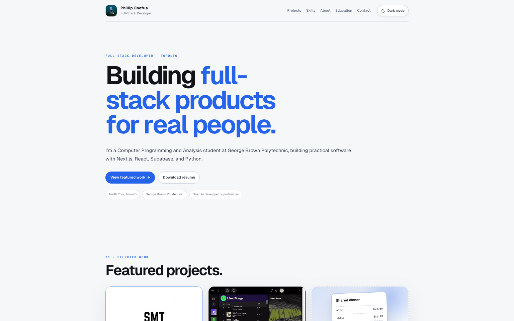

# Phillip Onofua — Developer Portfolio

A responsive personal portfolio showcasing my full-stack and desktop development work, technical skills, education, and contact information.

[View the live portfolio](https://philliponofua.vercel.app)



## Overview

This repository contains the source for my portfolio website. It is a framework-free static site built to present selected work clearly, load quickly, and remain usable across desktop and mobile devices.

## Technical highlights

- Responsive layouts designed for desktop and mobile
- Animated hero headline with reduced-motion support and screen-reader-friendly text
- Project case studies with live links, source code, or demos where available
- Expandable project details with smooth opening and closing transitions on mobile
- Sticky navigation and light/dark theme selection with saved preferences
- Downloadable résumé and direct contact links
- Semantic HTML and keyboard-accessible interactions

## Featured projects

### Student Market of Toronto

A student-focused marketplace for discovering, listing, saving, and discussing items across Toronto campuses. The project uses Next.js, React, Supabase, PostgreSQL, and Tailwind CSS.

**Role:** Team lead and full-stack developer

- [Open the live project](https://student-market-of-toronto.vercel.app)
- [View the source code](https://github.com/EdoiseO/student-market-of-toronto)

### Overlay Studio

A Windows desktop application for previewing, customizing, and launching animated OBS overlays. The portfolio includes a recorded product demo; the application is currently developed in a private repository.

**Status:** Independent development project; demo available on the portfolio

### Receipt Splitter

A mobile app for assigning shared receipt items, tax, and tip to individual people. This project is currently a work in progress.

**Status:** Work in progress

## Built with

- HTML5
- CSS3
- Vanilla JavaScript
- Web Animations API
- Vercel

The site is intentionally framework-free and runs as a static website with no build step.

## Run locally

Clone the repository and start a local static server:

```bash
git clone https://github.com/EdoiseO/phillip_onofua.git
cd phillip_onofua
python3 -m http.server 8000
```

Then open [http://localhost:8000](http://localhost:8000).

## Repository structure

```text
.
├── index.html                         # Page content and interactions
├── assets/
│   ├── styles.css                     # Base styles
│   ├── overrides.css                  # Responsive layout and visual refinements
│   ├── profile-photo.jpg              # Portfolio profile image
│   ├── portfolio-preview.png          # README portfolio preview
│   ├── student-market-placeholder.png # Student Market project artwork
│   ├── overlay-studio-demo.webm       # Overlay Studio product demo
│   └── phillip-onofua-resume.pdf      # Downloadable résumé
└── README.md
```

## Deployment

The production site is deployed on Vercel from the `main` branch.

## Contact

- [GitHub](https://github.com/EdoiseO)
- [Email Phillip](mailto:philliponofua@gmail.com)
